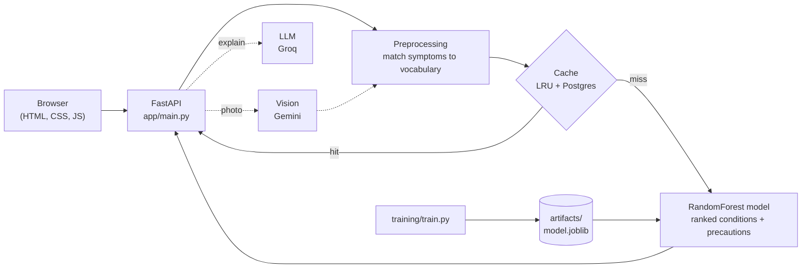

# HealthAI architecture

```mermaid
flowchart LR
    U["Browser<br/>(HTML, CSS, JS)"] --> API["FastAPI<br/>app/main.py"]

    API --> PRE["Preprocessing<br/>match symptoms to vocabulary"]
    PRE --> CACHE{"Cache<br/>LRU + Postgres"}
    CACHE -- miss --> MODEL["RandomForest model<br/>ranked conditions + precautions"]
    CACHE -- hit --> API
    MODEL --> API

    API -. "photo" .-> VIS["Vision<br/>Gemini"]
    VIS -.-> PRE
    API -. "explain" .-> LLM["LLM<br/>Groq"]

    TRAIN["training/train.py"] --> ART[("artifacts/<br/>model.joblib")]
    ART --> MODEL
```

Solid lines are the main text-prediction path. Dotted lines are optional features (image upload and explanations).
